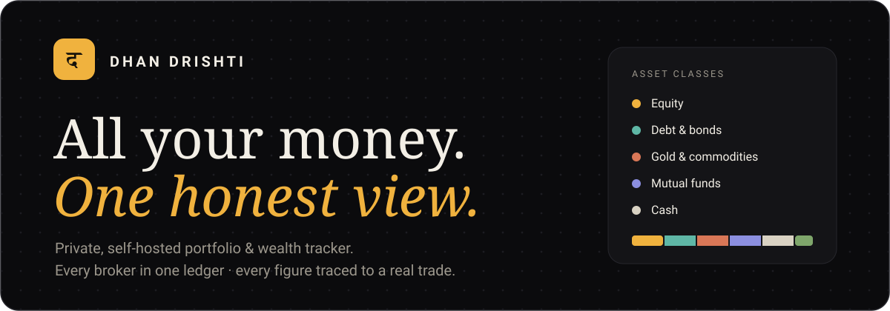

<div align="center">



<br/>

**Consolidate every broker into one normalized ledger — then see holdings, performance and net worth that always trace back to a real transaction.**

<br/>


&nbsp;
&nbsp;
&nbsp;
&nbsp;

</div>

---

Dhan Drishti turns a pile of broker exports into one clear picture of your wealth. Every figure on
the dashboard is **derived from your own transaction ledger** — nothing is placeholder, silently
faked or sent to a server you don't control.

```
broker CSV / Excel / CAS PDF ─▶ adapter ─▶ canonical ledger ─▶ derived holdings ─▶ analytics ─▶ dashboard
```

## ✨ Highlights

- 🔌 **Every broker, one ledger** — Zerodha, Dhan, Vested & Interactive Brokers (US), Binance
  (crypto), Excel (`.xlsx`) holdings, and a mutual‑fund **CAS PDF** (CAMS / KFintech — one
  password‑protected file covers every AMC), plus a generic column‑mapping importer for anything
  else. **Drop a file and it works out the rest** — checked against the broker's own P&L so the
  numbers reconcile. Imports are idempotent, deduped and **atomic** (all‑or‑nothing).
- 🧮 **Holdings you can trust** — average‑cost positions, invested value and realised P&L derived
  from the ledger, a **diversification / concentration score**, and a per‑security detail page with
  a **stock‑style price chart** drawn from real history. Missing prices show `—`, never a fake `0`.
- 📈 **Honest performance** — realised P&L by financial year, **XIRR**, a **time‑weighted return**
  valued at each trade from real historical prices, and a **benchmark overlay** that mirrors your
  exact cashflows into Nifty 50 / Sensex — a chart, not just a stat.
- 💰 **Full net worth** — holdings + cash + **manual assets** (FDs & bonds that **track their rate
  and maturity**, PPF / EPF / NPS, physical gold, real estate, savings), a **net‑worth‑over‑time**
  chart, and allocation by asset class, sector, **region** and currency. Foreign gains split into
  **asset vs. currency**.
- 🎯 **Plan, income & tax** — set **target weights** and see the drift in percent and rupees
  ("trim ₹X"), a trailing **dividend yield** with an estimated payout calendar, and a **FIFO
  capital‑gains** report (short‑ vs long‑term) you can export as CSV for your ITR.
- 📰 **Markets in context** — a **live index strip** and a **News page** that surfaces headlines for
  what you actually hold, with *checked‑at* vs *published‑at* times so you know how fresh it is.
- ⚙️ **Fresh & installable** — prices refresh nightly in the background and on login; the UI is an
  installable **PWA** with an offline shell.
- 🔒 **Private by design** — runs on your machine; only public ticker symbols (to price providers)
  and company names + headlines (to the News provider) ever leave it.

## 🖥️ The app

Six destinations; everything else lives under one of them.

| Destination | What's inside |
|---|---|
| 🏠 **Home** | Net‑worth headline + composition (holdings / cash / manual assets), net‑worth‑over‑time chart, allocation, top holdings, recent activity |
| 📦 **Portfolio** | **Positions** (avg cost, value, unrealised & realised P&L, class/sector filters), **Allocation** (asset class · sector · region · currency), a per‑**Security** detail page with price chart & contribution, and **Other assets** (FDs, bonds, gold, property…) |
| 🧾 **Activity** | The full ledger as a readable **day‑by‑day timeline**, plus **Dividends** — income by FY and security, trailing yield, forward calendar |
| 📈 **Performance** | **Returns** (realised P&L by FY, XIRR, TWR, benchmark overlay, diversification, FX‑impact), **Rebalance** (target weights, drift in % and ₹), and **Tax** (FIFO short/long‑term capital gains, CSV export) |
| 📰 **News** | A live index strip and headlines for your holdings, freshness‑stamped |
| 👥 **Accounts** | Drop‑anything **import wizard**, and **People & accounts** — family members, brokers, portfolios & groups |

> **Settings** (data export, account delete, FX rates) sits alongside the six.

## 🧱 Tech stack

| Layer | Choice |
|---|---|
| Frontend | React + TypeScript + Vite (route‑level code‑split), Tailwind CSS v4, **shadcn/ui**, TanStack Query, Recharts |
| Design | Dark‑only, solid colours, one marigold accent · **IBM Plex Sans** (tabular figures) + **Instrument Serif** display |
| Backend | Node + Fastify · argon2id auth · session cookies |
| Data | SQLite via Drizzle ORM + libsql (WAL; dialect‑swappable to Postgres) |
| Money | `decimal.js` — exact decimals end to end, **never floats** |
| Core | A pure, deterministic, unit‑tested calculation engine (no I/O) |

### 🎨 Palette

One ink surface, warm ivory text, a single marigold accent, and six fixed asset‑class colours used
identically on every chart. Green/red are reserved for gain/loss and always paired with a sign.


&nbsp;
&nbsp;
&nbsp;
&nbsp;

**Asset classes** &nbsp;

&nbsp;
&nbsp;
&nbsp;
&nbsp;
&nbsp;

## 🚀 Run it (one command)

Syncs dependencies, builds the web app, starts the single‑service server (API + UI on one port), and
opens your browser once it's ready. Your data persists in `./data` across runs.

```bash
./start.sh          # macOS / Linux
```

On Windows, double‑click **`start.bat`** (or run it from a terminal). Both need **Node.js + pnpm**.

> **Optional — the News page.** Copy `apps/server/.env.example` → `apps/server/.env` and add your
> Azure OpenAI key. Without it the app runs fine; News just stays quiet. Only company names and
> headlines are ever sent — never what you hold or how much.

## 🐳 Self‑host (single container)

The server serves the built SPA and the API on one port and runs DB migrations on boot.

```bash
docker compose up -d          # builds the image, runs on http://localhost:4000
```

The SQLite database lives in the `dhan-drishti-data` volume (`/data` in the container) — **back it
up by copying that file**. Each user can export their own data as JSON from Settings, or delete
their account (password‑confirmed). Set `SECURE_COOKIES=true` when serving behind HTTPS.

## 🔌 API

The web app is one client of a fully headless‑ready REST API.

- **Discovery** — `GET /api` lists every endpoint.
- **Contract** — `GET /api/openapi.json` (OpenAPI 3.1) loads straight into Swagger UI / Postman.
- **Reference** — see [`docs/API.md`](docs/API.md).

## 🔒 Security & privacy

argon2id password hashing · httpOnly `SameSite=Lax` session cookies · per‑user data isolation ·
a same‑origin (CSRF) guard on mutating requests · rate‑limited auth · a Content‑Security‑Policy and
security headers (HSTS behind HTTPS). Portfolio data never leaves your machine — only public ticker
symbols and currency codes (to price providers) and company names + headlines (to the News provider)
are ever sent, and prices only when you refresh.

## 🧪 Development

```bash
pnpm install
pnpm -r test        # 310 tests: core engine (92) + server (214) + web (4)
pnpm -r typecheck
pnpm --filter @dhan-drishti/server dev     # API on http://127.0.0.1:4000
pnpm --filter @dhan-drishti/web dev        # UI on http://localhost:5173 (proxies /api → server)
```

## 📁 Project layout

```
packages/core   canonical domain model + pure calculation engine (no I/O)   [unit-tested]
apps/web        React + Vite + Tailwind v4 + shadcn/ui + TanStack Query      [the UI]
apps/server     Fastify + Drizzle/libsql REST API + argon2 auth              [the API]
docs/           schema · calculations · importers · API reference + OpenAPI
```

## 🧭 Principles

> **No fake data or dead metrics** — every figure traces to a real imported or derived value; the
> few things that must be estimated (a dividend calendar, a benchmark mirror) say so plainly, and
> nothing here is tax or investment advice. **Money is never a float.** Broker logic is isolated
> behind a single `BrokerAdapter` interface. Writes are atomic, reads are cached, and your portfolio
> stays on your machine.

<div align="center"><br/><sub>Dhan Drishti — runs on your machine. No accounts sold, no data shared.</sub></div>
