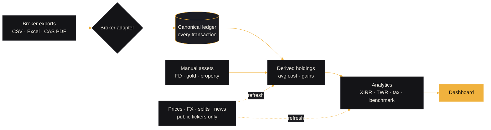
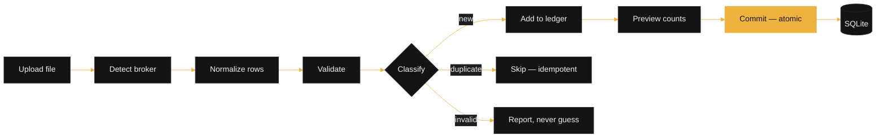
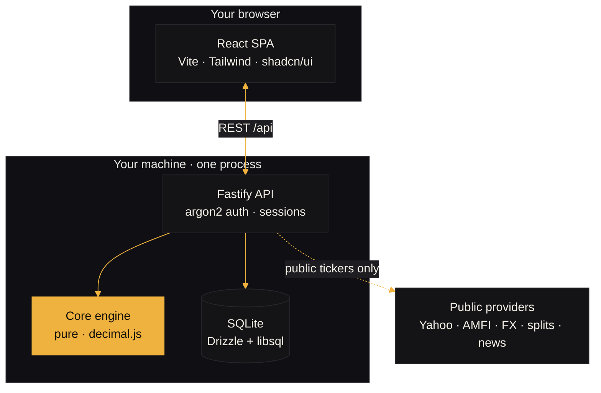

<div align="center">


<br/>

**Consolidate every broker into one normalized ledger — then see holdings, performance and net worth that always trace back to a real transaction.**

<br/>


&nbsp;
&nbsp;
&nbsp;
&nbsp;

</div>

---

Dhan Drishti turns a pile of broker exports into one clear picture of your wealth. Every figure on
the dashboard is **derived from your own transaction ledger** — nothing is placeholder, silently
faked or sent to a server you don't control.

## 🔭 How it works

From a messy folder of exports to one honest dashboard — each arrow is a step you can trace back.



**The import pipeline is atomic** — a file is detected, normalized, validated and classified, shown
to you as a preview, then committed all-or-nothing (and reconciled against the broker's own P&amp;L).



**One process, your machine.** The browser talks to a single Fastify service that owns the database
and a pure calculation engine; only public identifiers ever reach the outside world.



## ✨ Highlights

- 🔌 **Every broker, one ledger** — Zerodha (tradebook, holdings, tax P&amp;L), Dhan, Vested &
  Interactive Brokers (US), Binance (crypto), Excel (`.xlsx`) holdings and broker P&amp;L reports, and
  a mutual‑fund **CAS PDF** (CAMS / KFintech — one password‑protected file covers every AMC), plus a
  generic column‑mapping importer. **Drop a whole folder** and it recognises each broker, account
  and person on its own, skips anything already seen, and **checks your profit against the broker's
  own P&amp;L report**. Imports are idempotent, deduped and **atomic**.
- 🪄 **Fills the gaps itself** — **stock splits** your files leave out (Netflix's 10‑for‑1, say) are
  filled in from public data, each one **confirmed against your own trade prices** first; remove one
  and it never comes back. Holdings statements are reconciled against the trades, never added on top.
- 🩺 **Needs attention** — a page that pins down exactly what's missing: sales with no purchase on
  record, gaps between files, files that stop long ago, accounts with nothing added, missing
  dividends, unconfirmed splits, unpriced holdings — each with **the account, the stocks, and the
  exact broker file (with its dates) that fixes it**, plus how to download it.
- 👨‍👩‍👧 **People, brokers, markets** — track yourself or the whole family. **One filter bar** on every
  page narrows to any mix of **people**, **brokers** and **India / US**, and every figure is worked out
  from just that slice of the ledger.
- 🇺🇸 **US holdings in ₹, honestly** — a **"US in $ / ₹" switch**: value at today's rate, but cost,
  sales and dividends at **the rate on their own day**, so your rupee gain includes the dollar's move.
- 🧮 **Holdings you can trust** — average‑cost positions, invested value and realised gains derived
  from the ledger, a **portfolio X‑ray** (concentration, cash drag, sector skew), heatmaps and
  treemaps with values on hover, and a per‑security page with a **stock‑style price chart** drawn
  from real history. Missing prices show `—`, never a fake `0`.
- 📈 **Honest performance** — realised gains by financial year, **XIRR**, a **time‑weighted return**
  valued at each trade from real historical prices, winners & losers, and a **benchmark overlay**
  that mirrors your exact cashflows into Nifty 50 / Sensex / S&amp;P 500.
- 🔎 **Research any stock** — yours or not, anything listed in India or the US: price history,
  52‑week and period ranges, RSI, moving averages, support / resistance, **fundamentals**, and the
  latest news. Your own stocks add your position and buy/sell markers on the chart.
- 📰 **News on what you own** — headlines for your holdings and the market, refreshed on their own,
  a page per stock, and an optional **AI read** (risks, outlook, tailwind / headwind) via Azure OpenAI.
- 🧭 **Everything connected** — every stock links to its holding, research, news and trades; the
  **search in the top bar (⌘K)** answers from your portfolio first (value and return inline), then
  stocks you've sold, then any listed stock.
- 💰 **Full net worth** — holdings + cash + **manual assets** (FDs & bonds that **track their rate
  and maturity**, PPF / EPF / NPS, gold with **weight & purity**, real estate with **area &
  purchase date**), a **net‑worth‑over‑time** chart, and allocation by asset class, sector, **region**
  and currency. Foreign gains split into **asset vs. currency**.
- 🎯 **Plan, income & tax** — set **target weights** and see the drift in percent and rupees, a
  trailing **dividend yield** with an estimated payout calendar, and a **FIFO capital‑gains** report
  (short‑ vs long‑term) you can export as CSV for your ITR.
- 🚪 **A proper front door** — a front page that shows what it does, and sign‑in / create‑account
  pages; first‑time setup asks **which brokers you use** (or sets up the family) and creates the
  accounts for you.
- ⚙️ **Fresh & installable** — prices, exchange rates and splits refresh in the background and on
  login; the UI is an installable **PWA** with an offline shell.
- 🔒 **Private by design** — runs on your machine; only public ticker symbols, currency codes and
  company names ever leave it.

## 🖥️ The app

Seven destinations; everything else lives under one of them. Signed out, you land on the front page,
with **sign in** and **create account** one click away.

| Destination | What's inside |
|---|---|
| 🏠 **Home** | Net‑worth headline + composition, the live index strip, net‑worth‑over‑time chart, top movers, and **Needs attention** at a glance |
| 📦 **Portfolio** | **Positions** (avg cost, value, gains, heatmap, research/news shortcuts per row), **Allocation** (class · sector · region · currency), **Health** (X‑ray), a per‑**Security** page, and **Other assets** (FDs, bonds, gold, property…) |
| 🧾 **Activity** | The full ledger as a day‑by‑day **timeline** (filter to one stock), plus **Dividends** — income by FY, trailing yield, forward calendar |
| 📈 **Performance** | **Returns** (realised gains, XIRR, TWR, benchmark, winners & losers, FX impact), **Rebalance** (drift in % and ₹), and **Tax** (FIFO capital gains, CSV export) |
| 🔎 **Research** | Any stock — your position, chart, ranges, technicals, fundamentals and latest news |
| 📰 **News** | Live index strip, headlines for your holdings as tiles with an AI read, a market feed, and a page per stock |
| 👥 **Accounts** | Drop‑anything **import wizard**, **Needs attention** (what's missing and the file that fixes it), and **People & accounts** — family members, brokers, portfolios |

> **Settings** (data export, account delete, FX rates) sits alongside. Every data page shares the
> **people · brokers · market** filter, and US figures can be shown in ₹.

## 🧱 Tech stack

| Layer | Choice |
|---|---|
| Frontend | React 19 + TypeScript + Vite (route‑level code‑split), Tailwind CSS v4, **shadcn/ui**, TanStack Query, Motion, custom SVG charts + lightweight‑charts |
| Design | Dark‑only, solid colours, one marigold accent · **IBM Plex Sans** (tabular figures) + **Instrument Serif** display |
| Backend | Node + Fastify · argon2id auth · session cookies |
| Data | SQLite via Drizzle ORM + libsql (WAL; dialect‑swappable to Postgres) |
| Market data | Yahoo (prices, history, splits, fundamentals, search) · AMFI / mfapi (funds) · Frankfurter (FX) · Google News · optional Azure OpenAI |
| Money | `decimal.js` — exact decimals end to end, **never floats** |
| Core | A pure, deterministic, unit‑tested calculation engine (no I/O) |

### 🎨 Palette

One ink surface, warm ivory text, a single marigold accent, and six fixed asset‑class colours used
identically on every chart. Green/red are reserved for gain/loss and always paired with a sign.


&nbsp;
&nbsp;
&nbsp;
&nbsp;

**Asset classes** &nbsp;

&nbsp;
&nbsp;
&nbsp;
&nbsp;
&nbsp;

## ✅ Requirements

Dhan Drishti runs anywhere Node runs — **macOS, Windows or Linux**. You only need two tools (or just
Docker). Everything else is self‑contained.

| Need | Spec |
|---|---|
| **Node.js** | **20 or newer** (22 LTS recommended) |
| **pnpm** | **10+** — comes with Node via `corepack enable` |
| **Disk** | ~1.5 GB (dependencies) + your data in `./data` |
| **Memory** | 4 GB RAM is plenty |
| **Browser** | Any modern one — Chrome, Edge, Safari, Firefox |
| **Ports** | **4000** for the app (and **5173** in dev) |
| **Git** | Optional — only to clone or update |

<table>
<tr><th>🍎 macOS</th><th>🪟 Windows</th></tr>
<tr valign="top"><td>

**Fresh Mac? One script does it all.** In the project folder:

```bash
./setup.sh
```

Installs Homebrew (with the Xcode Command Line Tools), Node and pnpm — only what's missing — then
the project dependencies. Asks for your password once. Then run `./start.sh`.

</td><td>

**Fresh PC? One script does it all.** Double‑click **`setup.bat`** (or run it from a terminal).

Installs Node LTS via `winget` and pnpm — only what's missing — then the project dependencies.
Accept the admin prompt if one appears. Then double‑click **`start.bat`**.

> If it says Node was installed but can't be found, open a new terminal and run `setup.bat` again.

</td></tr>
</table>

Both scripts are safe to re‑run, and create `apps/server/.env` from the example if it's missing.

<details>
<summary>Prefer to install by hand?</summary>

1. Install Node 20+ from [nodejs.org](https://nodejs.org) (or `brew install node` on macOS)
2. `corepack enable` (turns on pnpm — or `npm install -g pnpm`)
3. Run `./start.sh` (macOS / Linux) or `start.bat` (Windows)

</details>

> **Prefer not to install anything?** With **Docker Desktop**, skip Node and pnpm entirely — see
> *Self‑host* below.

## 🚀 Run it (one command)

Syncs dependencies, builds the web app, starts the single‑service server (API + UI on one port), and
opens your browser once it's ready. Your data persists in `./data` across runs. (First time on this
machine? Run `setup.sh` / `setup.bat` first — see above.)

```bash
./start.sh          # macOS / Linux
```

On Windows, double‑click **`start.bat`** (or run it from a terminal).

> **Optional — the AI read on News.** Copy `apps/server/.env.example` → `apps/server/.env` and add your
> Azure OpenAI key. Without it the app runs fine; News shows headlines without the AI read. Only company names and
> headlines are ever sent — never what you hold or how much.

## 🐳 Self‑host (single container)

The server serves the built SPA and the API on one port and runs DB migrations on boot.

```bash
docker compose up -d          # builds the image, runs on http://localhost:4000
```

The SQLite database lives in the `dhan-drishti-data` volume (`/data` in the container) — **back it
up by copying that file**. Each user can export their own data as JSON from Settings, or delete
their account (password‑confirmed). Set `SECURE_COOKIES=true` when serving behind HTTPS.

## 🔌 API

The web app is one client of a fully headless‑ready REST API.

- **Discovery** — `GET /api` lists every endpoint.
- **Contract** — `GET /api/openapi.json` (OpenAPI 3.1) loads straight into Swagger UI / Postman.
- **Reference** — see [`docs/API.md`](docs/API.md).

## 🔒 Security & privacy

argon2id password hashing · httpOnly `SameSite=Lax` session cookies · per‑user data isolation ·
a same‑origin (CSRF) guard on mutating requests · rate‑limited auth · a Content‑Security‑Policy and
security headers (HSTS behind HTTPS). Portfolio data never leaves your machine — only public ticker
symbols and currency codes (to price, split and FX providers), what you type into stock search, and
company names + headlines (to the news provider and, if configured, the AI read) are ever sent —
never what you hold or how much.

## 🧪 Development

```bash
pnpm install
pnpm -r test        # 352 tests: core engine (108) + server (240) + web (4)
pnpm -r typecheck
pnpm --filter @dhan-drishti/server dev     # API on http://127.0.0.1:4000
pnpm --filter @dhan-drishti/web dev        # UI on http://localhost:5173 (proxies /api → server)
```

## 📁 Project layout

```
packages/core   canonical domain model + pure calculation engine (no I/O)   [unit-tested]
apps/web        React + Vite + Tailwind v4 + shadcn/ui + TanStack Query      [the UI]
apps/server     Fastify + Drizzle/libsql REST API + argon2 auth              [the API]
docs/           schema · calculations · importers · API reference + OpenAPI
```

## 🧭 Principles

> **No fake data or dead metrics** — every figure traces to a real imported or derived value; the
> few things that must be estimated (a dividend calendar, a benchmark mirror, an F&amp;O expiry
> settlement) say so plainly, and
> nothing here is tax or investment advice. **Money is never a float.** Broker logic is isolated
> behind a single `BrokerAdapter` interface. Writes are atomic, reads are cached, and your portfolio
> stays on your machine.

<div align="center"><br/><sub>Dhan Drishti — runs on your machine. No accounts sold, no data shared.</sub></div>
